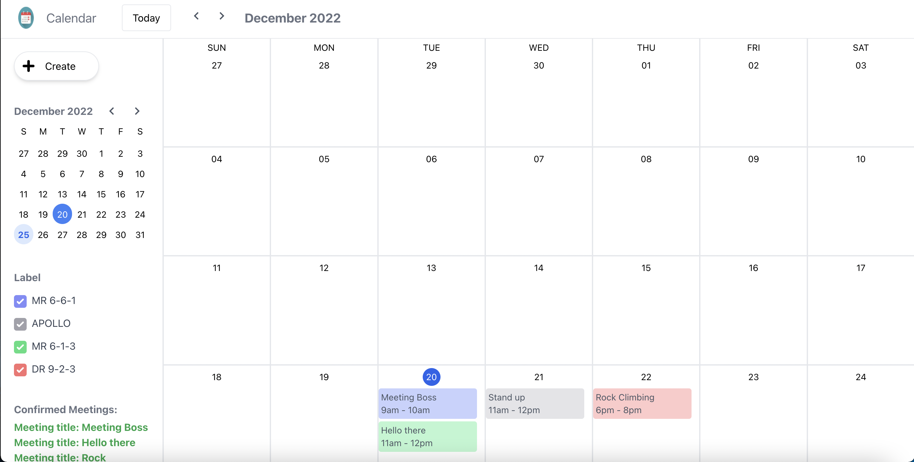

# Calendar App


## Project summary
This is a calendar app to put all your events to organize your life and to organise if your meetings are confirmed or cancelled. You can write the event title, set your time and put the specific meeting room. 

## Project details
This calendar app has full CRUD capabilities to create your meetings/events and you have the ability to filter your meetings. In addition, your confirmed meetings and cancelled meetings will appear at the side bar of your calendar.

## Technical details
This is mainly a front end application built using React JS and CSS Tailwind for UI. As I did not use a NOSQL or SQL database to store the events data, I had to utilize local storage to store the data. From there, I can pull the data from there to display it which requires understanding of manipulating and handling of JSON data. To update the displays for certain calendar events, I had to utilise useContext and Global context to have proper state management though some of them did not turn as I expected which I will talk about it in the technical challenges. 

I had to properly separate the different components into its various parts like the header, sidebar, the small calendar, the large calendar, the event description modal and the labels to filter the meeting rooms and to display the confirmed and cancelled meetings.

## Technical Challenges
I had to utilise a few youtube tutorials, stack overflow and other online resourses to create the design for the grid calendar and for other necessary functions such as useContext, useEffect and other state management. I still have issues updating the confirmed meeting and cancelled meeting as I need to refresh the page for it to appear and issue with displaying the meeting room name instead of the colour. I tried to implement a hash table to put the keys as the colours and the values as the meeting room name but unforunately I cannot loop through the values of the hash table and display them. 

I do admit that I'm not able to filter through based on the status, meeting rooms and room types due to time and space constraint on the UI and to include all of the data would make the calendar look too cluttered. 

## Future Improvements

If I have more time as I was swarmed with finals, projects and assignments for me to give enough time to focus on this, I would have fixed the technical challenges that I have listed above and potentially used a database to store all the information that I needed instead of using local storage as it is not a very secure way of storing data. 

The calendar is mobile responsive but if it is too small like on an IPhone SE, the grids will mash together and it will look horrendous. 

## Sample photos



## How to use

Type this command into your command line:

``` 
git clone git@github.com:Nihilus888/Calendar-App.git
```

When you are in that folder, type 

```
npm start 
```

and enjoy!

Would love to hear your feedback or additonal thoughts!

